# Farmony Architecture Diagrams (Mermaid)

## Table of Contents
1. [System Architecture Overview](#1-system-architecture-overview)
2. [Module Structure & Dependencies](#2-module-structure--dependencies)
3. [ServiceRequest Lifecycle Flow](#3-servicerequest-lifecycle-flow)
4. [Wave-Based Matching Algorithm](#4-wave-based-matching-algorithm)
5. [Database Schema Relationships](#5-database-schema-relationships)
6. [Authentication & Authorization Flow](#6-authentication--authorization-flow)
7. [Data Embedding Strategy](#7-data-embedding-strategy)
8. [Client-Server Communication Pattern](#8-client-server-communication-pattern)
9. [API Request Flow](#9-api-request-flow)

## 1. System Architecture Overview


*\* = Future Implementation (Post-MVP)*

## 2. Module Structure & Dependencies


## 3. ServiceRequest Lifecycle Flow


## 4. Wave-Based Matching Algorithm


### Wave Expansion Visualization


## 5. Database Schema Relationships


## 6. Authentication & Authorization Flow


### Role-Based Access Control


## 7. Data Embedding Strategy

```mermaid
flowchart LR
    subgraph "Traditional Normalized"
        U1[Users Table]
        A1[Addresses Table]
        B1[Bookings Table]
        R1[Ratings Table]
        P1[Payments Table]

        U1 -->|FK| A1
        B1 -->|FK| R1
        B1 -->|FK| P1
        U1 -->|FK| B1
    end

    subgraph "Our Embedded Approach"
        U2[User Document<br/>+ addresses[]<br/>+ ratingSummary{}]
        SR[ServiceRequest<br/>+ lifecycle.matching{}<br/>+ lifecycle.order{}<br/>+ ratings{}<br/>+ payment{}]
    end

    style U1 fill:#ffcccc
    style A1 fill:#ffcccc
    style B1 fill:#ffcccc
    style R1 fill:#ffcccc
    style P1 fill:#ffcccc

    style U2 fill:#ccffcc
    style SR fill:#ccffcc
```

### Embedding Decision Tree

```mermaid
flowchart TD
    A[Data Relationship] --> B{1-to-1 or<br/>1-to-few?}

    B -->|Yes| C{Frequently<br/>accessed together?}
    B -->|No| D[Use References]

    C -->|Yes| E{Under 16MB<br/>total size?}
    C -->|No| D

    E -->|Yes| F{Low update<br/>frequency?}
    E -->|No| G[Use Bucketing]

    F -->|Yes| H[✓ Embed Data]
    F -->|No| D

    style H fill:#90EE90
    style D fill:#FFB6C1
    style G fill:#87CEEB
```



## 8. Client-Server Communication Pattern


### Polling Intervals & Strategy

| Resource | Polling Interval | When to Poll | Cache Strategy |
|----------|-----------------|--------------|----------------|
| Service Request Status | 5-10 seconds | While status is 'open' or 'in_progress' | ETag/If-None-Match |
| Conversation Messages | 10 seconds | When chat screen is open | Last message timestamp |
| Dashboard Metrics | 30 seconds | When dashboard is visible | 5 minute cache |
| Available Listings | On demand | On search/filter change | 10 minute cache |
| User Profile | On demand | On profile view | 1 hour cache |

### Push Notification Events


## 9. API Request Flow


### Error Handling Pipeline


## Legend

- **Solid Lines**: Implemented/MVP features
- **Dashed Lines**: Future implementations
- **Green Fill**: Optimal/Recommended approach
- **Red Fill**: Avoided/Anti-pattern
- **Blue Fill**: Alternative approach

## Notes

1. All diagrams represent the target architecture as defined in [03-module-structure.md](./03-module-structure.md)
2. ServiceRequest is the central entity containing the entire transaction lifecycle
3. Wave-based matching is the core differentiator of the platform
4. Embedding strategy optimizes for read performance over write flexibility
5. Future features (marked with *) are designed but not implemented in MVP